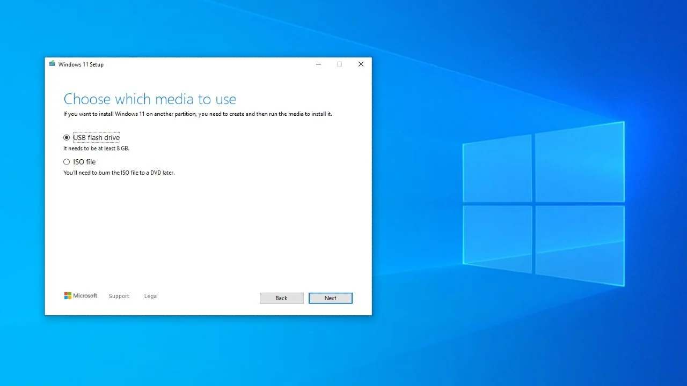

> [!Warning]
> This document may be too long to navigate comfortably. If you have any questions, ask the Microsoft Q&A or related communities.
# Overview

You may notice your **Windows 10** device repeatedly notifying you regarding *migrating to Windows 11*. This help file will cover topics regarding *migration* in sections such as:

* **Discontinuation and Support Information**
* **Installation Prerequisites**
* **Preparation**
* **Installing Windows 11 with and without bootable media**
* **Changes in Windows 11**
* **FAQ**

If you are a user preparing for migration, this help file can be of assistance.
* ****
# Discontinuation and Support Information

> [!Note]
> **Windows 10**'s latest major version *22H2* is ending support on October 14th, 2025. Windows 10 will no longer receive free software updates (including *quality updates* and *feature updates*) or technical assistance<sup><a href="https://www.microsoft.com/windows/end-of-support">[1]</a></sup>.

As Windows 10 reaches end of support, the big question is.. *"Can I stay on Windows 10? Why should I go to Windows 11?"*. Well, of course! It is totally normal to stay with Windows 10 longer. When comparing the minimum system requirements, **Windows 10** tends to be less resource-demanding<sup><a href="https://techcommunity.microsoft.com/discussions/windows11/windows-11-vs-windows-10-a-comprehensive-comparison-of-features-and-performance/3760255">[2]</a></sup>, potentially due to less resource-heavy features and security. However, switching to **Windows 11** introduces refined security options and new features that can open a new pathway for your computer (such as *Windows Hello* for identification). Perhaps some devices can still run on Windows 10? You are in luck! In fact, you can participate in the yearly, paid program known as **ESU**, formally known as the *Microsoft Extended Security Updates* program. Enterprises usually use the *Extended Security Updates* program for their corporate and enterprise devices, such as *kiosks, embedded devices, and specialized devices*.

The **ESU** program does not include these update features upon activation:

* **New Windows features**, these usually come with *feature updates*.
* **Customer-requested non-security updates**. Again, these can be classified as *feature updates*, where **ESU** only extends support for security updates.
* **Design change requests**, following the criteria of non-security updates.
* **General support**. Usually, you will need an active support plan to get technical assistance.<sup><a href="https://learn.microsoft.com/windows/whats-new/extended-security-updates">[3]</a></sup>

Now, you may ask, *"How much does the ESU program cost?"*. Well, it costs **$61 USD** per year, as the price consecutively doubles, with a maximum support period of *three years*.<sup><a href="https://learn.microsoft.com/windows/whats-new/extended-security-updates">[3]</a></sup>

However, recent versions and few older *specialized and embedded editions* still maintain mainstream support since **August of 2025**, such as *IoT (Internet of Things) Enterprise LTSC 2021*, or just *IoT Enterprise*. This especially applies for the non-GAC (*General Availability Channel*) editions.<sup><a href="https://learn.microsoft.com/lifecycle/end-of-support/end-of-support-2025">[4]</a></sup>
# Installation Prerequisites

**Windows 11** can be more resource-demanding than **Windows 10** due to its enhanced features, a more modern interface, and stricter system requirements. To install Windows 11, your system must check out on these prerequisites:

* 1 gigahertz **(GHz)** or larger with *2 or more* cores on a **compatible 64-bit processor** or System on a Chip **(SOC)**.
* 4 gigabytes **(GB)** of *RAM / memory*
* 64 gigabytes **(GB)** or a larger storage device.
* Unified Extensible Firmware Interface **(UEFI)** being enabled on the firmware. **Secure Boot** must be capable of activation on said system.
* Trusted Platform Module **(TPM)** of version 2.0 **(TPM 2.0)** must be enabled.
* Must be compatible with DirectX version 12 or later with a Windows Display Driver Model **(WDDM)** 2.0 driver.
* Must have a high definition (at least *720p, or 720 pixel*) display that is greater than *9" diagonally*, including at least *8 bits per color channel* **(Red, Green, Blue)**<sup><a href="https://www.microsoft.com/windows/windows-11-specifications">[5]</a></sup>.

To be sure you are eligible for installing **Windows 11**, you can use the **PC Health Check** application to check your eligibility. The application scans your PC's system health and can identify performance issues with troubleshooting. If you *do not have **PC Health Check** installed on your computer*, you can install it [here](https://support.microsoft.com/windows/how-to-use-the-pc-health-check-app-9c8abd9b-03ba-4e67-81ef-36f37caa7844).<sup><a href="https://support.microsoft.com/windows/how-to-use-the-pc-health-check-app-9c8abd9b-03ba-4e67-81ef-36f37caa7844">[6]</a></sup>

> A screenshot is shown below, displaying the **PC Health Check** application.


# Preparation

> [!Tip]
> Windows Update is typically the easiest way to migrate.<sup><a href="https://support.microsoft.com/windows/ways-to-install-windows-11-e0edbbfb-cfc5-4011-868b-2ce77ac7c70e">[7]</a></sup>

Now we are ready. However, to be careful, back up your data before continuing. You can back up your data through `Control Panel > System and Security > Backup and Restore` or relying on cloud options such as **OneDrive**.  See [this guide](https://support.microsoft.com/office/back-up-your-folders-with-onedrive-d61a7930-a6fb-4b95-b28a-6552e77c3057) to get started on *OneDrive* and data backups. For other links or references related to data preservation, see more in the citations.<sup><a href="#^add-link1">[16]</a></sup><sup><a href="#^add-link2">[17]</a></sup><sup><a href="#^add-link3">[18]</a></sup><sup><a href="#^add-link4">[19]</a></sup>
^backup-note

To begin, you can go to `Settings > Windows Update` and check for installation there. It will prompt and be *shown as a free upgrade*.<sup><a href="https://support.microsoft.com/en-us/windows/ways-to-install-windows-11-e0edbbfb-cfc5-4011-868b-2ce77ac7c70e">[7]</a></sup>

> A screenshot is shown below, displaying an installation prompt in **Windows Update**.


However, you can also use these resources to install **Windows 11**<sup><a href="https://www.microsoft.com/software-download/windows11">[8]</a></sup>:

* A *fresh ISO image*, but it must contain an installation of Windows 11.
* The **Installation Assistant**, which *does not support ARM-based devices*.<sup><a href="https://support.microsoft.com/windows/windows-arm-based-pcs-faq-477f51df-2e3b-f68f-31b0-06f5e4f8ebb5">[9]</a></sup>
* The **Create Installation Media** tool (*MediaCreationTool.exe*), which can be paired with the ISO image and insertable media (such as a *USB* or blank *DVD disc*, it is important to note that CDs cannot hold modern Windows media<sup>[a]</sup>.)

To get started, you can use these links corresponding to the architecture:

| Architecture          | Edition                                                                                                        | Links                                                                                                                                                              |
| --------------------- | -------------------------------------------------------------------------------------------------------------- | ------------------------------------------------------------------------------------------------------------------------------------------------------------------ |
| x86-64                | All editions except Enterprise editions can be installed here, found in the Volume Licensing Center.           | [Download Windows 11](https://www.microsoft.com/software-download/windows11)<br>[Installation Assistant Download](https://go.microsoft.com/fwlink/?linkid=2171764) |
| ARM (including ARM64) | All editions except Enterprise editions can be installed here, found in the Volume Licensing Center.<nl>^table | [Download Windows 11 Arm64](https://www.microsoft.com/software-download/windows11arm64)                                                                            |

Now with this out of the way, the following subsections will provide steps for each method:
## ISO image

To install **Windows 11** on a **Windows 10** device *using an ISO image*, you can follow these steps:

1. Click one of the links above in [the table](#^table) corresponding to your system architecture
2. Scroll down and find the disk image option (*represented in screenshot* 1)
3. Select your download edition (typically multi-edition)
4. Select the product language you would like (to see your system's current set language, go to `Time and Language` in *PC Settings* or `Region` in *Control Panel*) (*represented in screenshot* 2)
5. After this, it will redirect you to an ISO image download link, available for 24 hours on the site.<sup><a href="https://superuser.com/questions/1272009/downloading-windows-10-iso-within-24-hours">[10]</a></sup> It will not interrupt the downloading process if the link expires.
6. Once downloaded to your system, **mount the image** as a **drive** and find *setup.exe*, then execute it. Do not delete the *ISO* yet, in case the setup fails.
7. Look for `[drive letter]\setup.exe` in the drive of your mounted image. Execute it as *Administrator*. This will guide you through installation, where USBs or other media (such as DVDs, and SSDs) will boot into `[drive letter]\sources\setup.exe`, which is a more flexible installer with *partition/disk formatting*, *installation path (to partition)*, and *a wider range of options*.

For bootable media, *do not mount the image* and instead follow steps in the [[#Bootable Media|bootable media]] subsection.

> [!Tip]
> Gigabit ethernet can download a **Windows** ISO image within minutes,<sup><a href="https://www.techtarget.com/searchnetworking/definition/Gigabit-Ethernet">[11]</a></sup> although it depends on other factors.


<a id="bootable-media"></a>
## Bootable Media
This section will cover how to install **Windows 11** with bootable media. First, make sure your insertable media follows these requirements<sup><a href="https://support.microsoft.com/windows/create-installation-media-for-windows-99a58364-8c02-206f-aa6f-40c3b507420d">[13]</a></sup>:

* A computer with a reliable internet connection. Download times for a disk image can vary based on several network conditions.
* A *clean USB drive* with at least **8 Gigabytes** of storage. It is recommended to use a *blank* USB drive, as any data on the drive **will be removed.**
* A product key. This will be used to activate the version of **Windows 11** you choose to install. For example, if you have **Windows 10 Home** and plan to install **Windows 11 Home**, you will not need to get a separate product key. Enterprise editions or non-GAC *(General Availability Channel)* versions, and product keys, must be installed through the *Volume Licensing Center*<sup>[VLSC]</sup> and *Evaluation Center*, now functioning in the **M365/Microsoft 365 Admin Center**<sup><a href="https://learn.microsoft.com/en-us/microsoft-365/commerce/licenses/manage-volume-licensing?view=o365-worldwide">[14]</a></sup>. It is important to note that the **Evaluation Center** did not join the portfolio of **Microsoft 365** services and products.
* It is helpful to check for available disk space, as Windows may not perform as expected.

Now, we are ready to begin! Refer to [[#ISO image|the section above]] to install a disk image, as we will need it.

Follow these steps to prepare **Windows 11** bootable media:
1. Prepare your insertable media. Insert it into an available port meant for PNP[<sup>[abbr, 1]</sup>](^abbr-1); such as a USB port if it is a USB device. Make sure your insertable media's targeted partition is formatted as FAT32. You can format your USB in *Disk Management* or *DiskPart*
2. Open *Disk Management* through `WIN+R > diskmgmt.msc` or Start Menu `Disk Management` and select the USB partition. If not already, format the partition as FAT32 with the guide. If the *install.wim* file in the ISO is over 4 GB, mount it to a directory or virtual drive and use *DISM* to split the file into **.swm** files. You can also format the USB as NTFS, however, you may need UEFI:NTFS drivers on a separate FAT32 partition (not needed on MBR systems). For DiskPart, you can use the commands, (QUICK format parameter is optional):

 ```Batch
   diskpart
   lis vol
   sel vol (flashdrive)
   format fs=fat32 [quick]
   exit
   ```
3. On the computer you are preparing to install **Windows 11** from the bootable media on, enter the *BIOS* or *UEFI* menu. The firmware key or UEFI key is manufacturer-specific. Once you are on the menu, look for an option similar to *Boot Menu*. After clicking the key displayed corresponding to the Boot Menu or **BIOS**, locate the boot order settings and move the detected USB drive to the top, as the highest boot priority.<sup><a href="https://help.corsair.com/hc/en-us/articles/14206252671117-Windows-How-to-Install-Windows-10-11-Using-the-Media-Creation-Tool#h_01GW5299S3ZJ3W07JBBA7SWQK0">[15]</a></sup> If your USB is formatted as NTFS to boot from a modern system (particularly one that runs on UEFI), you will need external UEFI:NTFS drivers or a re-format to FAT32.
4. Exit the boot menu and power off the PC, or restart into the main OS.
5. Go [here](https://go.microsoft.com/fwlink/?LinkId=691209) in a web browser and run `MediaCreationTool.exe`, or instead, feel free to use third-party software such as *Rufus*, *MCSBTool*, *Etcher*, and more. *(There is a large selection of third party tools where you can find links at the end of the document!)*
6. Select your flash drive or other device you wish to install Windows Setup on. Additionally, the disk image could be present on the USB drive itself. It may ask for the language, system architecture, and edition. Select the edition you have a product key for, or install one for which you do not have a product key for. For editions you do not have a product key to activate, you should **activate the PC after installation**. Rufus has a different format for creating bootable media, see [this guide](https://kb.filewave.com/books/filewave-general-info/page/rufus-creating-bootable-usb-drives).
7. After the bootable media is ready and finished fetching setup files and applying them, insert it into the PC you wish to begin installation of Windows 11 on. If you are reinstalling or clean installing on the same system, power off the device via power button, insert the drive, power it back on, and select the drive from the boot menu. After it boots from the flash drive, you should see a message regarding the installation of Windows 11, in a window known as **Windows 11 Setup** or simply **Windows Setup**.

There will be multiple preferences, such as *language, time and currency, and input method*. Each window will proceed to installation, and even a repair option. You will need to enter your product key during setup; otherwise, you can press **"I don't have a product key."**, but Windows will not be activated until a product key is entered, and activation can occur without entering a product key if a digital license has been linked to your hardware or Microsoft account. Do *not* remove the flash drive during setup.

You will need to select a disk during setup to install Windows on. Selecting one means you will also decide which partition on the disk will contain your installation of Windows (or let *Windows* decide automatically), but this partition will be formatted and *all data will be erased*. You can utilize *DISKPART* from the **Command Prompt** (accessible through the key `F10`) to find useful information about your disks and partitions. For more information regarding `diskpart.exe`, see [this page](https://learn.microsoft.com/windows-server/administration/windows-commands/diskpart).

For more assistance with **Windows Setup**, see these pages:
1. [Reinstall Windows with the installation media](https://support.microsoft.com/windows/reinstall-windows-with-the-installation-media-d8369486-3e33-7d9c-dccc-859e2b022fc7) - *Microsoft Support, webpage support.microsoft.com*

-------

***Setup Images***


![WindowsSetup.png]](/assets/WindowsSetup.png)

***MediaCreationTool Images***




## Installation Assistant
To Install **Windows 11** using the *Installation Assistant*, this section covers just that.
Refer to the table in this [[#Preparation|section]] to download the *Installation Assistant*. 

1. Install the *Installation Assistant* on your computer.
2. Run the Installation Assistant.
3. Proceed to check for compatibility with **Windows 11** and allow the installation sequence to progress. This may take some time. Maybe go *grab a snack* while you're at it?
4. Restart your computer once it is finished. It may display the **First Logon Animation**, but this means it is loading your applied user settings with new features and settings.<sup><a href="https://www.spyshelter.com/exe/microsoft-windows-firstlogonanim-exe/">[12]</a></sup>


## Post-installation

If you have chose to use *bootable media*, or clean install to **Windows 11**, you can process this with multiple steps.
* If you have used a clean install from bootable media, or in a *Virtual Machine*, skip to [[#Bootable Media|this subsection]]. 
* If you have used a clean install without using external media or on a pre-configured installation, skip to [[#Reset|this subsection.]].

You should only read this section *after* the installation via the methods above. Now that you have made it past the stage of patience, here's what you can do.

### Reset
A reset or clean reinstallation without using external media will typically open **OOBE (Out-Of-Box Experience)** upon first boot after installation.

After you clean install Windows 10 to 11, these are some steps you should take to ensure you have smooth sailing with your experience on **Windows 11**:
* Set up your PC using **OOBE**, select your language, currency, time zone, and more. Let the process check for updates as well, as it has been known to check for *Windows updates*.
* Upon finishing the **OOBE** process, it is advised to remove the default applications that you will not use (such as *Candy Crush* if you do not play it).
* Change user settings to your liking, why not personalize it?

You can remove persistent or unremovable applications through PowerShell[<sup>[b]</sup>](#^foot-b), using:
```powershell
get-appxpackage -name "*appname*" | select -exp PackageFullName | remove-appxpackage
```
It is recommended to restart to clean up files after removing the app. This only works if an .APPX file is found for said application provided.

The code provided looks for all .APPX packages containing the placeholder *"appname"*, selects only their package's full name, and removes the .APPX package, effectively removing the application with it.<br>^foot-b

Be careful with data loss. For a guide on backing up data, see [this reference](#^backup-note). You can access other links at:
1. [Back up and restore with Windows Backup](https://support.microsoft.com/windows/back-up-and-restore-with-windows-backup-87a81f8a-78fa-456e-b521-ac0560e32338) - *Microsoft Support, webpage support.microsoft.com* ^add-link1
2. [System Restore](https://support.microsoft.com/windows/system-restore-a5ae3ed9-07c4-fd56-45ee-096777ecd14e) - *Microsoft Support, webpage support.microsoft.com* ^add-link2
3. [Move your files to a new Windows PC using an external storage device](https://support.microsoft.com/windows/move-your-files-to-a-new-windows-pc-using-an-external-storage-device-dd139b2e-bc73-4431-8e6e-c96e10dffdf5) - *Microsoft Support, webpage support.microsoft.com* ^add-link3
4. *"Save personal files to an external storage device and later use tools such as `robocopy`, `copy`, or even `xcopy` or third-party software to then send personal files on said external device to the C: drive, where they previously had been."* - Type **footnote/text reference** ^add-link4

Now that you've personalized and finalized the setup stage, just make sure, you can disconnect your USB if you haven't done during the OOBE. Typically, you can disconnect after the setup is finished (OOBE or First Logon Animation).

# Citations
[1] - https://www.microsoft.com/windows/end-of-support
[2] - https://techcommunity.microsoft.com/discussions/windows11/windows-11-vs-windows-10-a-comprehensive-comparison-of-features-and-performance/3760255
[3] - https://learn.microsoft.com/windows/whats-new/extended-security-updates
[abbr, 1] - PNP: *Plug and Play*
[4] - https://learn.microsoft.com/lifecycle/end-of-support/end-of-support-2025
[5] - https://www.microsoft.com/windows/windows-11-specifications
[6] - https://support.microsoft.com/windows/how-to-use-the-pc-health-check-app-9c8abd9b-03ba-4e67-81ef-36f37caa7844
[7] - https://support.microsoft.com/en-us/windows/ways-to-install-windows-11-e0edbbfb-cfc5-4011-868b-2ce77ac7c70e
[8] - https://www.microsoft.com/software-download/windows11
[9] - https://support.microsoft.com/windows/windows-arm-based-pcs-faq-477f51df-2e3b-f68f-31b0-06f5e4f8ebb5
[10] - https://superuser.com/questions/1272009/downloading-windows-10-iso-within-24-hours
[11] - https://www.techtarget.com/searchnetworking/definition/Gigabit-Ethernet
[12] - https://www.spyshelter.com/exe/microsoft-windows-firstlogonanim-exe/
[13] - https://support.microsoft.com/windows/create-installation-media-for-windows-99a58364-8c02-206f-aa6f-40c3b507420d
[14] - https://learn.microsoft.com/en-us/microsoft-365/commerce/licenses/manage-volume-licensing?view=o365-worldwide
[15] - https://help.corsair.com/hc/en-us/articles/14206252671117-Windows-How-to-Install-Windows-10-11-Using-the-Media-Creation-Tool#h_01GW5299S3ZJ3W07JBBA7SWQK0
[16] - [An item listed in a bulletin.](#^add-link1)
[17] - [Another item listed in a bulletin.](#^add-link2)
[18] - [Third item in the same bulletin list.](#^add-link3)
[19] - [Fourth and final item in the bulletin list.](#^add-link4)
[Backup Note] - "Now we are ready. However, to be careful, back up your data before continuing. You can back up your data through `Control Panel > System and Security > Backup and Restore` or relying on cloud options such as **OneDrive**.  See [this guide](https://support.microsoft.com/office/back-up-your-folders-with-onedrive-d61a7930-a6fb-4b95-b28a-6552e77c3057) to get started on *OneDrive* and data backups. For other links or references related to data preservation, see more in the citations."
[Footnote B] - "The code provided looks for all .APPX packages containing the placeholder *"appname"*, selects only their package's full name, and removes the .APPX package, effectively removing the application with it."
[Table] - [The edition listing table.](#^table)
[VLSC] - An abbreviation for Microsoft's *Volume Licensing Center.*

# Extras
## Third-party media creation links

*MCSBTool* - PowerShell based automation (with manual steps provided), [you can find it here.](https://github.com/itsSysTime/MCSBtool) This tool is not very popular, as it was recently created.
*Rufus* - A giant in bootable media creation, [here it is!](https://rufus.ie)
*Etcher* - Also a giant and popular tool for bootable media creation, *why search* when you can [find it here?](https://www.balena.io/etcher)
*Media Creation Tool* (**MCT**) - Widely used, made by **Microsoft** *officially*, it can be found in the same document, for download, [here.](https://go.microsoft.com/fwlink/?LinkId=691209)
*Ventoy* - Also popular, you can find it at [the official website.](https://www.ventoy.net)
*UNetbootin* - More popular on **Linux**, but usable on **Windows and MacOS**, can be found at [their official GitHub site.](https://unetbootin.github.io)

> [!Note]
> There may be other media creation tools that exist, but this document cannot cover them all. Feel free to contribute.

